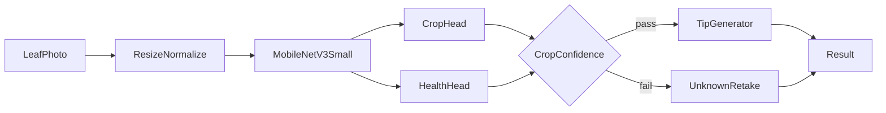

# Plant Health Image Processing — Implementation Guide

**Audience:** engineering  
**Status:** original spec (2026-08-12). **v0 as built:** [v0-implementation.md](v0-implementation.md)  
**Companion research:** [research/vision-model-donor-brain-brief.md](research/vision-model-donor-brain-brief.md)

This document is the **pre-build spec**. Where it disagrees with v0 (leaf-only, 5-way crop, unknown as software-only, TFLite already shipped), trust [v0-implementation.md](v0-implementation.md).

---

## 1. Product contract

### 1.1 Job

Given a **leaf-dominant close-up photo**, the system returns:

| Field | Values |
| --- | --- |
| Crop | `palay` (rice), `eggplant`, `lettuce`, `tomato`, `sili` (pepper) |
| Health | `healthy`, `mild`, `critical`, `dead` |
| Confidence | 0–1 per head |
| Tip | short English recommendation |
| Unknown | if crop confidence is below threshold → `unknown` + retake message |

The model does **not** identify tomato cultivars. Crop is species-level only. Crop list is versioned and will expand later.

### 1.2 Hardware (target, not MVP blocker)

| Item | Spec |
| --- | --- |
| Compute | Raspberry Pi 4B, 8 GB RAM, 128 GB microSD |
| Camera | Raspberry Pi Camera V2 NoIR Wide |
| Lighting | Daytime outdoor; onboard visible LEDs as fill only |
| Display | Touchscreen LCD later; motors owned by other developers |

### 1.3 Operating modes (product, later wiring)

| Mode | Behavior | This team's MVP |
| --- | --- | --- |
| Manual | Operator drives, presses capture | Image in → result out |
| Auto | Detect plant → pause robot → capture → grade → resume | **Deferred.** Motor pause requires other developers. |

MVP proves the **image → crop + health + tip** loop on a PC first.

### 1.4 Explicit non-goals for MVP

- Motor pause / GPIO / serial robot link
- Touchscreen polish
- Night / IR illumination pipeline
- Cloud models (GPT, Qwen, Pl@ntNet API)
- On-device BioCLIP / NFNet / RF-DETR
- Continuous video at 30 FPS
- “All Filipino crops” as an open-ended claim

---

## 2. Architecture

### 2.1 Runtime pipeline



One **shared CNN backbone**, two **classification heads**. The product API is crop + health, not a 38-way disease name.

### 2.2 Model shape

```
input: RGB 224x224
backbone: ImageNet-pretrained MobileNetV3-Small
  → global average pool
  ├─ head_crop: Linear → Softmax(5)
  └─ head_health: Linear → Softmax(4)

loss = λ_crop * CE(crop) + λ_health * CE(health)
start λ_crop = λ_health = 1.0
```

`unknown` is **not** a trained sixth crop class in v1. It is a **software gate** on softmax confidence (crop first; health optional).

### 2.3 Tip generation

| Stage | Mechanism |
| --- | --- |
| Vision MVP | Template strings keyed by `(crop, health)` if LLM blocks demo |
| After vision works | Local quantized LLM, ~1–3B, English only |
| On Pi | Run **vision then LLM sequentially** — do not peak both at once |

Tips are generated from structured fields. The LLM does not look at the raw image in MVP.

### 2.4 Persistence (Pi phase)

| Store | Role |
| --- | --- |
| SQLite | scan rows: timestamp, crop, health, confidences, tip, image path |
| JPEG on disk | captured frame per scan |
| CSV | export only, not the live store |

---

## 3. Donor brain and fine-tuning

Fine-tuning **updates network weights**. It does not store a gallery of photo embeddings and nearest-neighbor match them.

### 3.1 Chosen donor

**Primary:** ImageNet-pretrained `mobilenet_v3_small` (torchvision or TF equivalent).  
**Fallback:** EfficientNet-Lite0 / B0, or a PlantVillage MobileNetV2 checkpoint with heads replaced.

Why Small, not Large: same task, more RAM/latency headroom for a later tiny LLM on Pi 4 8 GB.

### 3.2 Training procedure

1. Build remapped dataset (section 4).
2. Split by **leaf / source id**, not random files (PlantVillage `leaf_id` grouping).
3. **Phase A (3–5 epochs):** freeze backbone; train heads only.
4. **Phase B:** unfreeze last backbone blocks; lower learning rate.
5. **Phase C (optional):** full network, still lower LR.
6. Track **crop accuracy** and **health macro-F1**. Report `dead` separately — it will be weak on public data.
7. Export **INT8 TFLite** (post-training quantization; QAT if accuracy drops).
8. After robot NoIR photos exist: short domain-adapt fine-tune with a lower LR.

### 3.3 Augmentation (farm gap)

Apply during training: brightness/contrast jitter, mild blur, rotation, JPEG compression noise. This is a stand-in until real robot photos exist. It does not replace local capture.

### 3.4 What happens when new photos arrive

1. Label each image with `crop` + `health`.
2. Load the current checkpoint.
3. Continue training at a low learning rate (domain adaptation).
4. Re-export TFLite.

No embedding index rebuild. The same network’s weights are updated.

---

## 4. Data

### 4.1 Label map (required)

Version-controlled file: `data/label_map.yaml`.

Every public class string maps to `{crop, health}`. Example policy (agronomy review later):

| Public-style label | Health |
| --- | --- |
| healthy | `healthy` |
| early blight, bacterial spot, leaf mold, limited brown spot | `mild` |
| late blight, yellow leaf curl, mosaic, wilt, tungro | `critical` |
| severe necrosis / fully desiccated if labeled | `dead` |

Public datasets almost never have a native `dead` class. Expect a weak `dead` head until local photos.

### 4.2 Dataset sourcing (free / open only)

**Policy:** no paid datasets. Round 1 = public open-access leaf sets. Round 2 = our Raspberry Pi / NoIR captures. Do not train on pre-augmented copies when originals exist.

Prefer **original** images. Cite each source. Keep a `data/SOURCES.md` log of URL, license, date downloaded, and which classes we used.

#### Primary sources (download these first)

| Crop | Dataset | Get it | Size / classes | License | Role |
| --- | --- | --- | --- | --- | --- |
| Tomato | PlantVillage (color) | [Hugging Face `mohanty/PlantVillage`](https://huggingface.co/datasets/mohanty/PlantVillage) · [GitHub](https://github.com/spMohanty/PlantVillage-Dataset) | ~54k images, 14 crops; tomato has healthy + many diseases | **CC BY-SA 3.0** | Main tomato volume. Split by `leaf_id`. Use `color`, not grayscale. |
| Sili / pepper | PlantVillage bell pepper | same as above | `Pepper,_bell___healthy` + `Pepper,_bell___Bacterial_spot` | **CC BY-SA 3.0** | Starter pepper. Bell ≠ all chili cultivars. |
| Sili / chili | Chili leaf disease (Bangladesh) | [Mendeley `w9mr3vf56s`](https://data.mendeley.com/datasets/w9mr3vf56s/1) | **1,856 originals** (ignore the 12k augmented pack): bacterial spot, curl virus, cercospora, nutrition deficiency, white spot, healthy | **CC BY 4.0** | Real chili/sili leaves. Prefer this over bell pepper when both exist. |
| Eggplant | Eggplant Leaf Disease Detection | [Mendeley `d3ypkphghb`](https://data.mendeley.com/datasets/d3ypkphghb/2) · paper [10.1016/j.dib.2025.111353](https://doi.org/10.1016/j.dib.2025.111353) | 4,089 images: healthy, insect pest, leaf spot, mosaic, white mold, wilt | **CC BY 4.0** | Primary eggplant. White-background lab-ish — domain gap vs farm. |
| Palay / rice | RiceLeafBD | [Mendeley `kx9rx8p2mz`](https://data.mendeley.com/datasets/kx9rx8p2mz/1) | 1,555 field images: healthy, bacterial leaf blight, brown spot, tungro | **CC BY 4.0** | Primary rice (real field). |
| Palay / rice | BanglaRiceLeaf | [Harvard Dataverse](https://doi.org/10.7910/DVN/XAOBYW) | 4,152 images: blight, streak, sheath blight, blast, healthy | check Dataverse license on download | Extra rice volume / variety. |
| Lettuce | Lettuce plant disease | [Kaggle `santoshshaha/lettuce-plant-disease-dataset`](https://www.kaggle.com/datasets/santoshshaha/lettuce-plant-disease-dataset) | 2,813 images: bacterial, fungal, healthy | **CC0** | Only usable public lettuce pile. Weakest crop — collect Raspi lettuce early. |

#### Secondary / mix-in (after primaries)

| Dataset | Get it | License | Why |
| --- | --- | --- | --- |
| PlantDoc (cropped classification) | [GitHub pratikkayal/PlantDoc-Dataset](https://github.com/pratikkayal/PlantDoc-Dataset) | **CC BY 4.0** | ~2.5k in-the-wild images. Stress-test / second fine-tune. Not the only train set. Tomato/pepper-ish; not rice/lettuce. |
| OLID-I | [Zenodo 8105154](https://zenodo.org/records/8105154) · [Kaggle raiaone/olid-i](https://www.kaggle.com/datasets/raiaone/olid-i) · paper [Frontiers 2023](https://www.frontiersin.org/journals/plant-science/articles/10.3389/fpls.2023.1251888/full) | **CC BY 4.0** | 4,749 field images, tropical crops including **tomato + eggplant**. Prefer Zenodo if Kaggle login is a hassle. |
| UCI Rice Leaf Diseases | [UCI 486](https://archive.ics.uci.edu/dataset/486/rice+leaf+diseases) | **CC BY 4.0** | Only **120** images. Optional extra, not a primary. |
| SLIF-Brinjal (eggplant field) | [Mendeley `6yg6vktrc2`](https://doi.org/10.17632/6yg6vktrc2) | Cite required; **confirm license on the page before use** | ~9k in-field brinjal. Use only if license is clearly open. |

#### Do not buy / do not use as primary

- Commercial leaf packs, Roboflow paid plans, PlantNet cloud API
- Chili **augmented** 12k copies (use the 1,856 originals)
- Random Kaggle mirrors of PlantVillage (use the HF/GitHub original)
- Any set whose card is “research only” without a CC / open license we can live with

#### License notes

- **CC BY 4.0:** use, including commercially, with attribution.
- **CC BY-SA 3.0 (PlantVillage):** attribution + share-alike if we **redistribute adapted images**. Training a model is the intended research use; do not republish the raw PV dump as our dataset without following SA.
- **CC0 (lettuce Kaggle):** public domain; still keep the download URL in `data/SOURCES.md`.

#### Round 2 (ours, not purchased)

Raspberry Pi Camera V2 NoIR Wide, daytime, leaf-close. Priority shots: **lettuce**, **dead / necrotic**, **palay in PH fields**, **sili (not bell pepper)**. Label `crop` + `health` the same way as `label_map.yaml`.

### 4.3 MVP done bar

**Demo-done:** folder of test images → terminal prints crop, health, confidence, tip; results are mostly right. No hard accuracy gate for the first demo.

---

## 5. Software delivery

### 5.1 Phases

| Phase | Deliverable |
| --- | --- |
| 0 | This docs set + `data/label_map.yaml` |
| 1 | Train MobileNetV3-Small multitask; export TFLite |
| 2 | PC: CLI + folder batch + drag-and-drop |
| 3 | English tips (templates, then tiny local LLM) |
| 4 | Pi: TFLite + Camera V2 NoIR + button capture |
| 5 | Fine-tune on robot photos; optional leaf detector for auto |

### 5.2 PC MVP interfaces

| Input | Command / UX |
| --- | --- |
| Single file | `python scan.py path/to/leaf.jpg` |
| Folder batch | `python scan.py --dir path/to/folder` |
| Drag-and-drop | small desktop window; drop image; print result |
| Live camera | after batch/CLI works |

Printed result:

```
crop: tomato
health: mild
crop_confidence: 0.91
health_confidence: 0.74
tip: ...
```

### 5.3 Target repo layout

```
docs/
  implementation-guide.md
  client-overview.md
  research/vision-model-donor-brain-brief.md
data/label_map.yaml
training/
models/
src/scan_cli.py
src/scan_drop.py
src/infer.py
```

### 5.4 Pi deploy (after PC demo)

- Runtime: **TFLite / LiteRT** with INT8; not PyTorch on-device.
- Capture: `picamera2`, leaf-close framing.
- History: SQLite + JPEG; CSV export later.
- Button is the capture trigger. Auto plant-find + motor pause is a later integration.

### 5.5 Deferred detection stack

When auto mode returns: a nano detector can find a leaf/plant, then this classifier grades the crop. Ultralytics YOLO is **AGPL-3.0** — license must be reviewed before product use. Prefer Apache/MIT detect stacks if that is a blocker.

---

## 6. RAM and latency budget (Pi 4 8 GB)

| Slice | Rough RAM |
| --- | --- |
| OS + Python | 0.8–1.5 GB |
| Tiny LLM later (1B-class Q4) | 0.8–1.5 GB |
| INT8 classifier + buffers | ~0.1–0.5 GB |
| Camera / app / headroom | remainder |

Latency target for MobileNet INT8 classify: **under 200 ms** on Pi 4 CPU. YOLO-class detect, if added later: **0.5–2 s** is acceptable for a button press, not live video.

---

## 7. Fallback and stop conditions

| If | Then |
| --- | --- |
| MobileNetV3-Small underfits crop or health | Swap backbone to EfficientNet-Lite0/B0; keep the same two heads and API |
| Tomato/pepper good, rice/lettuce poor | Keep architecture; add data, do not jump to ViT/BioCLIP |
| Field photos fail after lab-trained demo | Domain-adapt on robot NoIR captures |
| Auto framing is the blocker | Add leaf detector as preprocessor only |

Do not replace the classifier with BioCLIP, RF-DETR, or a cloud API to “fix” health grading.

---

## 8. Decision log (locked)

- Four health levels: healthy, mild, critical, dead
- Five v1 crops; expand later with a new versioned list
- One vision model, two heads
- Public datasets first; hybrid with robot photos later
- Manual disease → health mapping
- Daytime outdoor; LEDs as backup fill
- Leaf-close framing for MVP
- History: SQLite + JPEG; CSV on export
- Train on PC/Colab; infer on Pi
- MVP demo: PC terminal (CLI, batch, drag-and-drop)
- Tips: English; tiny local LLM after vision works
- Low confidence → unknown + retake
- Motors / auto pause: later, other developers
