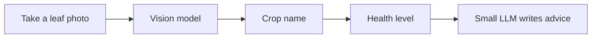
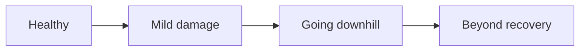
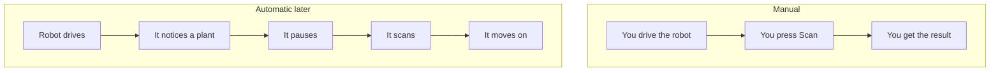
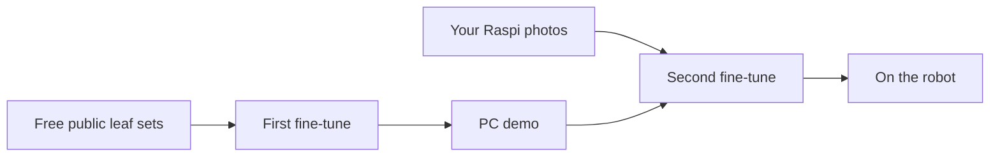
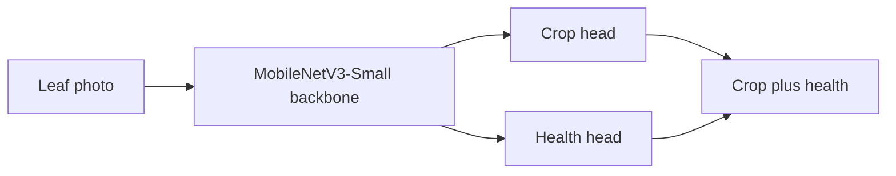
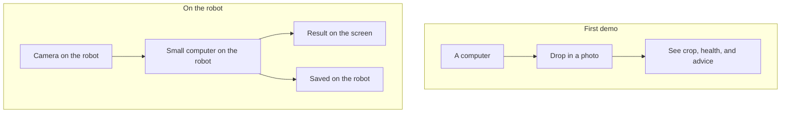

# Plant Health Scanner — What We Are Building

**v0 as built:** [v0-implementation.md](v0-implementation.md) (PC demo, leaf CNN + plant dictionary + wording). This page is the original product story.

## In one sentence

The robot takes a **photo of a leaf or whole plant**. A **vision stack** says **what crop it is** and **how healthy it looks**. A small writer turns that into **short advice** — all on the machine, without sending photos to the internet.

---

## What the farmer sees

Two brains, one job:

| Piece | Role | Everyday version |
| --- | --- | --- |
| Vision model | Looks at the leaf | The inspector |
| Small LLM | Writes the tip in English | The note-taker |

The LLM does **not** invent the diagnosis. It only writes advice from the inspector’s result (crop + health). It is a **local** model on the robot — not ChatGPT in the cloud.

Example result:

- **Crop:** tomato  
- **Health:** a bit damaged  
- **Advice:** a few plain-English next steps  

If the photo is unclear, the system says **try again** instead of guessing.

---

## The four health levels

Think of a fuel gauge, not a lab report.

| Level | Meaning |
| --- | --- |
| Healthy | Looks fine |
| Mild | Alive, but has spots or damage |
| Critical | In serious trouble |
| Dead | Too far gone |

We are **not** naming the exact disease (blight vs mold). We are grading **how bad the plant looks**.

---

## Crops in the first version

First release covers five common farm crops:

- Palay (rice)
- Eggplant
- Lettuce
- Tomato
- Sili

More crops can be added later. The first version is **not** “every plant in the Philippines.”

---

## Two ways to use it

**Now:** prove that photos are graded correctly.  
**Later:** connect that to the robot’s motors so auto-pause can work. Driving the robot is a separate team.

---

## How we teach the software (fine-tuning)

We do **not** invent plant knowledge from a blank page. We use **fine-tuning**.

Fine-tuning is like hiring a student who already finished school on millions of everyday photos, then drilling them on **your** farm job. We are not teaching “what is a leaf” from zero. We are teaching “this leaf is tomato, and it looks mildly damaged.”

1. Start with **MobileNetV3-Small**, a vision model that already knows how to look at pictures.  
2. Show it many labeled leaf photos (public farm/leaf collections first).  
3. **Fine-tune** it on **our** answers: which of the five crops, and which of the four health levels.  
4. Shrink that model so it fits on the Raspberry Pi, then put it on the robot.  
5. Later, **fine-tune again** on photos from **your actual robot camera** so it matches real field lighting and height.

When new photos arrive, we **fine-tune a bit more** on those photos. That updates how the model answers. We do not rebuild from zero, and we do not store a giant photo album to “search” against. The model itself gets a little smarter.

---

## Where the practice photos come from

We **do not buy datasets**. First practice is free/open leaf photos. Second practice is photos from **your robot camera**.

| Crop | Free source we will use | Notes |
| --- | --- | --- |
| Tomato | [PlantVillage](https://huggingface.co/datasets/mohanty/PlantVillage) | Biggest pile. Lab-clean leaves. Free (CC BY-SA 3.0). |
| Sili | [Chili leaves, Bangladesh (Mendeley)](https://data.mendeley.com/datasets/w9mr3vf56s/1) plus PlantVillage bell pepper | Real chili first; bell pepper is a stand-in. Free (CC BY 4.0 / CC BY-SA). |
| Eggplant | [Mendeley eggplant 4,089 images](https://data.mendeley.com/datasets/d3ypkphghb/2) | Free (CC BY 4.0). Extra field photos from [OLID-I](https://zenodo.org/records/8105154) if we want messier backgrounds. |
| Palay | [RiceLeafBD](https://data.mendeley.com/datasets/kx9rx8p2mz/1) and [BanglaRiceLeaf](https://doi.org/10.7910/DVN/XAOBYW) | Free field rice. Not in PlantVillage. |
| Lettuce | [Kaggle lettuce set (~2,800 images)](https://www.kaggle.com/datasets/santoshshaha/lettuce-plant-disease-dataset) | Free (CC0). Thinnest crop — we should photograph lettuce with the Raspi early. |

A smaller “real looking” set, [PlantDoc](https://github.com/pratikkayal/PlantDoc-Dataset) (CC BY 4.0), is a second practice round so the model is not only used to studio leaves.

**What we will not do:** pay for leaf packs, or use fake extra copies of the same photo (some sites ship “12,000 augmented” chili images — we use the originals only).

**What your robot photos are for:** lighting, height, NoIR camera look, Philippine field, lettuce, and “dead” plants — public sets barely have those.

---

## The vision model we will use

This is the **donor brain** for the first version: a ready-made inspector we fine-tune, not a model built from scratch.

**CNN** means **Convolutional Neural Network** — software that scans a photo in small patches (edges, then spots, then “this looks like palay”). Our CNN is **MobileNetV3-Small**. It grades the **whole frame**. It does not draw a square on a live video; that would need a separate detector. A fuller write-up is in [v0-implementation.md](v0-implementation.md#3-vision-student-cnn).

**MobileNetV3-Small** (V2 is an acceptable twin), ImageNet-pretrained, with **two heads**: crop (5 names) and health (4 levels). We train on a PC, then ship **INT8 TFLite** to the Raspberry Pi.

| Item | Specifics |
| --- | --- |
| What | Lightweight CNN. Shared trunk (the “eyes”). One head names the crop. The other grades health. |
| Why Small, not Large | Same job, more room on the Pi 4 8 GB for the small LLM later. Move to V3-Large only if Small is not accurate enough. |
| Why this model | One network, two answers. Proven for plant-leaf transfer learning. Fits the Pi with **TFLite INT8**. |
| Pi reality | Typically tens to a few hundred milliseconds per photo on Pi 4 CPU. Small memory footprint. TFLite on ARM, not PyTorch on the robot. |
| Fine-tune effort | Low–medium. Train on a PC or Colab in days, not weeks. |
| Train then ship | Fine-tune on a PC → export a small INT8 TFLite file → run that file on the Raspberry Pi. |
| If it underfits | Swap the backbone to EfficientNet-Lite0/B0, or warm-start from a PlantVillage MobileNet — same two heads. |

**Why this, not the other stacks we looked at**

- **EfficientNet** — often a bit more accurate, usually slower on the Pi. Keep as backup, not the first ship.
- **YOLO** — finds the leaf in a messy frame. Useful later for auto “see plant → pause.” Overkill for close-up leaf photos now, and heavier next to the LLM.
- **BioCLIP-class models** — strong at “what species is this,” too big for Pi + LLM, and they do not grade healthy → dead.
- **Vision transformers** — extra complexity on Pi CPU. Skip unless the CNNs fail.

**Tradeoff we accept:** starter weights learned everyday photos (ImageNet), and public leaf sets are often clean lab shots — not your robot/NoIR field look. That is why we fine-tune again later on your robot photos.

---

## The small LLM (advice writer)

After the vision model grades the leaf, a **small local LLM** writes 2–4 sentences of English advice.

| What it is | What it is not |
| --- | --- |
| A compact language model on the Pi | A cloud chatbot (no GPT / Qwen online) |
| Fed crop + health, then writes a tip | Looking at the photo itself in the first version |
| Runs **after** the vision model, not at the same time | A second plant doctor |

If the LLM is not ready for the first demo, the same screen can still show **template advice** (fixed text for “tomato + mild,” and so on). The farmer still sees a recommendation either way.

---

## Where it runs

- First demo: a computer. Drop photos in, read the answers.  
- Next: the same **fine-tuned** scanner on the robot, using the camera you already have.  
- Photos, the vision model, and the small LLM stay **on the machine**. No cloud required.

---

## What we save

Each scan can keep:

- The photo  
- The crop and health result  
- The advice  
- The time it was taken  

That history lives on the robot. It can be exported as a spreadsheet later if you need reports.

---

## What this project is — and is not

| We are doing | We are not doing in this first slice |
| --- | --- |
| Fine-tune a vision model on leaf photos | Train a giant model from scratch |
| Grade leaf health from a close photo | Name every disease in a textbook |
| Name the crop from the five on the list | Identify every plant in the country |
| Small local LLM writes English advice | Cloud GPT / Qwen |
| Run everything on the robot | Send farm photos to the internet |
| Build the “eyes and grade” | Wire the motors (other developers) |

---

## Build order (plain language)

1. **Fine-tune** the vision model on public leaf photos.  
2. **Show** it working on a computer (folder of pictures, or drag-and-drop).  
3. **Add** English tips (templates first, then the small local LLM).  
4. **Move** it onto the robot camera.  
5. **Fine-tune again** with real farm photos from your robot.  
6. **Connect** auto-scan to driving when the motor team is ready.

---

## What you should expect from the first demo

A working loop:

**photo in → crop + health + advice out**

It will be strongest on crops with lots of existing photos (especially tomato and pepper). Rice, lettuce, and “dead” plants get better after we collect pictures from your own fields.
