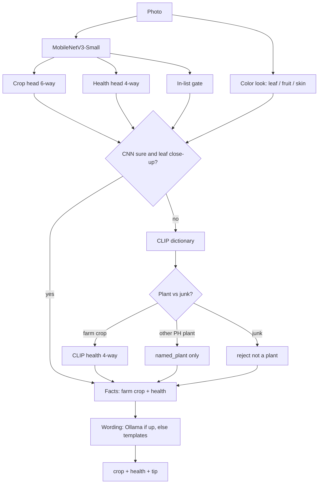

# Plant Health Scanner — v0 as built

**Status:** implemented (PC demo)  
**Date:** 2026-08-14  
**Hardware target:** Raspberry Pi 4B 8 GB (not yet deployed)  
**Plan docs (intent, not as-built):** [initial-plan.md](initial-plan.md), [implementation-guide.md](implementation-guide.md)

This page is how v0 actually works. The plan assumed a leaf-only two-head CNN plus a later LLM. v0 shipped a **leaf CNN**, an **open plant dictionary**, and **structured wording**.

---

## 1. What v0 does

Drop a photo. The system returns:

| Field | Meaning |
| --- | --- |
| `crop` | Farm crop if known: `palay`, `sili`, `tomato`, `eggplant`, `lettuce` — else `unknown` |
| `health` | `healthy` · `mild` · `critical` · `dead` — else `unknown` |
| `view` | `leaf` (CNN close-up), `plant` (whole plant / fruit / field), `junk` (not a crop) |
| `named_plant` | Dictionary name when the CNN does not own the class (e.g. kape, mais) |
| `tip` | Short English advice from structured facts only — the writer never sees the pixels |

Health is a **severity gauge**, not a disease name (not “early blight”).

v0 runs on a **PC** (`scan_cli`, `scan_drop` with webcam). Live/Shutter draw **red plant boxes** first, then fill in crop and health. Pi TFLite, Pi Camera, and SQLite history are **not** in this slice.

---

## 2. Runtime pipeline



Roles:

| Piece | Job | Everyday version |
| --- | --- | --- |
| CNN (`models/best.pt`) | Names the five farm crops and grades leaf health | Inspector who studied leaf homework |
| CLIP dictionary (`data/plant_dictionary.yaml`) | Names whole plants / extra PH species; grades plant-view health | Librarian with a frozen phrase list |
| Wording (`src/wording.py`) | Writes the tip from JSON facts | Note-taker — no photo |

The CNN does **not** carry a 549 MB VGG19. CLIP runs only when the CNN is unsure or the shot is not a leaf close-up.

---

## 3. Vision student (CNN)

### What a CNN is

**CNN** = **Convolutional Neural Network**. It is a program that looks at a photo the way a stack of cookie cutters looks at dough.

A normal spreadsheet cannot “see.” A photo is a grid of colored dots (pixels). A CNN slides small filters across that grid. Early filters pick up edges and speckles. Later filters pick up “leaf shape,” “spots,” “tomato-ish.” The last layer is a multiple-choice vote: which crop, which health grade.

```text
pixels → edges / textures → leaf / fruit patterns → crop + health scores
```

That is **not** a language model and **not** a bounding-box finder. A CNN grader (ours) scores the **whole picture**. It does not draw a square around the plant. Video is just many stills; without a separate detector there is still no box on screen.

| Term | In this project |
| --- | --- |
| CNN / backbone | MobileNetV3-Small — the “eyes” |
| Head | Tiny extra layer that votes: crop, health, or in-list |
| Weights / `.pt` file | The learned knobs (~3.68 MB). Not a zip of training photos |
| Fine-tune | Start from ImageNet (everyday photos), then drill on our leaves |
| Softmax | Forces crop scores to add to 100% among the listed classes |

**Why a CNN and not ChatGPT:** it is small enough for a Raspberry Pi, fast on a still photo, and trained to output **our** crop and health labels. ChatGPT-style models read pixels with a huge brain and language; they do not fit beside a local tip writer on 8 GB RAM.

CLIP (the dictionary) is a cousin: also vision, but it matches a photo to **text phrases** (“a tomato plant in a greenhouse”) instead of a fixed 6-bubble crop test.

### Architecture

**File:** `src/model.py` · **weights:** `models/best.pt` (~3.68 MB)

```
ImageNet MobileNetV3-Small backbone
  → GAP 576-d
  ├─ crop_head: Linear → 6  (palay, eggplant, lettuce, tomato, sili, other)
  ├─ health_head: Linear → 4  (healthy, mild, critical, dead)
  └─ gate_head: Linear → 1   (sigmoid: in-list farm leaf?)
```

Started from torchvision `MobileNet_V3_Small_Weights.DEFAULT` (ImageNet). Fine-tuning updated weights; training images are **not** stored inside the `.pt` file.

### Training sequence (as run)

| Step | Script | What happened |
| --- | --- | --- |
| 1 | `training/download.py` | Chili, eggplant, rice, PlantVillage tomato/pepper |
| 2 | `training/remap.py` | Folders → `crop` + `health` via `data/label_map.yaml` |
| 3 | `training/train.py` | Freeze heads, then unfreeze last 4 blocks; AdamW |
| 4 | `training/download_negatives.py` | ~3k objects + ~2k other-plant leaves |
| 5 | `training/finetune_other.py` | Sixth class `other`; junk must not become palay |
| 6 | `training/finetune_gate.py` | Binary in-list head; hard-negative mining |

Backups: `models/best_5crop.pt` (before `other`), `models/best_before_gate.pt`.

**Lettuce** is on the crop list but had **0** rows in `data/manifest.csv` at v0 train time. The CNN did not sit that class. Dictionary phrases can still name lettuce on a plant shot.

Grouped split by `group_id` (not random files) to limit same-leaf leakage.

---

## 4. How a scan decides

`src/infer.py` · `Scanner.scan`

1. **Color look** — green/yellow vegetation, red fruit, skin-like pixels (`plant_look`).
2. **CNN** — crop softmax, health softmax, in-list gate.
3. **Trust the CNN** when it names a farm crop and is not in the unknown gates (low confidence, low margin, `other`, low in-list). That is **leaf view**. Health comes from the CNN.
4. **Otherwise** run CLIP on the photo vs the dictionary:
   - Junk (person, animal, object) → `view=junk`, no crop.
   - Farm crop id → `crop` set, **plant view**, health from CLIP 4-way phrases.
   - Other PH plant → `named_plant` only; no farm health grade.
5. **Wording** sees only `{reject, reason, crop, health, view, dictionary_guesses[]}`.

Unknown gates (CNN): `crop_unknown_threshold`, `crop_margin_threshold`, `other_threshold`, `in_list_threshold` in `data/label_map.yaml`.

A greenhouse full of tomatoes is **plant view** (fruit + vines). A bacterial-spot tomato leaf is **leaf view** (CNN). A toad in grass is **junk**.

---

## 5. Dictionary (expand without retraining the CNN)

**List:** `data/plant_dictionary.yaml`  
**Encoder:** OpenAI CLIP ViT-B/32 (`transformers`)  
**Cache:** `models/dictionary_clip.pt` via `python training/cache_dictionary.py`

Each entry has `id`, `kind` (`plant` or `junk`), English `name`, local name, and phrases (leaf **and** whole-plant / fruit / field). Health phrases cover the four grades, generic plus per farm crop.

Add a plant: append YAML, recache. Do not fine-tune MobileNet for that name unless you want it as a **graded farm crop**.

CLIP is the open-vocab “dictionary.” It is heavier than the CNN; v0 loads it lazily on the plant/junk path.

---

## 6. Wording (LLM last)

`src/wording.py`

1. If **Ollama** is up (`OLLAMA_HOST`, default `llama3.2:1b`) — chat completion from the JSON facts.
2. Else if `LLM_MODEL` is set — Hugging Face generate.
3. Else **templates** in `src/tips.py` keyed by `(crop, health)`, plus dictionary sentences for named plants and junk.

The writer must not invent a crop. v0 PC demo typically uses templates unless Ollama is running.

---

## 7. How to run (PC)

```text
python src/scan_cli.py path\to\photo.jpg
python src/scan_cli.py --dir path\to\folder
python src/scan_drop.py
```

`scan_drop` opens the PC webcam.

| Mode | What it does |
| --- | --- |
| **Shutter** (default) | Live preview. **Snap** freezes the frame and grades it. **Retake** goes back to preview. |
| **Live** | Auto-grades while you point the camera (whole frame, no boxes). |
| **Browse** | Still photo from disk. |

Need `models/best.pt`. First dictionary hit downloads CLIP into `data/.cache/hf` if missing.

Eval (CNN-era holdout / robot-wild sets):

```text
python training/eval_holdout.py
python training/eval_realistic.py
```

---

## 8. Repo layout (v0)

```text
data/
  label_map.yaml              # disease folder → crop + health + thresholds
  plant_dictionary.yaml       # PH phrases + health phrases
  manifest.csv                # remapped train/val rows (gitignored)
  SOURCES.md
docs/
  v0-implementation.md        # this file
  initial-plan.md             # original product story
  implementation-guide.md     # original engineering spec
  research/
models/
  best.pt                     # live student
  best_5crop.pt
  best_before_gate.pt
  dictionary_clip.pt          # CLIP text cache
src/
  model.py infer.py dictionary.py wording.py tips.py
  scan_cli.py scan_drop.py labels.py paths.py
training/
  download.py remap.py train.py
  download_negatives.py finetune_other.py finetune_gate.py
  cache_dictionary.py
  download_holdout.py eval_holdout.py
  download_realistic.py eval_realistic.py
```

---

## 9. Not in v0

| Planned | v0 |
| --- | --- |
| INT8 TFLite on Pi | PyTorch on PC |
| Pi Camera V2 NoIR capture | Drag-and-drop / CLI files |
| SQLite scan history | None |
| Motor pause / auto plant-find | PC boxes in `scan_drop`; Pi auto-find still later |
| Distill VGG19 into the student | CNN is ImageNet→leaf fine-tune; CLIP is separate |
| Lettuce CNN class | Dictionary-only until lettuce photos exist |
| Cloud VLMs | Forbidden |

VGG19 was researched as a PH “best model” claim. It is **not** the Pi engine. See [research/vgg19-philippine-plant-recognition.md](research/vgg19-philippine-plant-recognition.md).

---

## 10. Boxes (two-stage)

v0 PC `scan_drop` draws **red boxes** like a street detector. Fast find first, slow homework later.

| Stage | What | Speed |
| --- | --- | --- |
| 1. Find | Box every plant (`plant` label, red). YOLO-World if loaded, else green-color finder. | Fast |
| 2. Name | CNN crop on each box | Medium |
| 3. Health / extra | Health + CLIP name + tip on the box | Slow, fills in after |

Live and Shutter both show boxes while you aim. **Snap** freezes the frame and keeps grading boxes. Cap: 5 largest plants.

Ultralytics YOLO-World is AGPL-3.0 — license check before product ship.

---

## 11. Decision log (v0)

- Five farm crops + `other` + in-list gate; junk is not a crop name.
- Four health levels on leaves (CNN) and on plant-view farm crops (CLIP).
- Extra PH names live in the YAML dictionary, not in the CNN softmax.
- LLM / templates see facts only, never the image.
- Demo is PC; Pi export is next.
- Whole-plant photos are first-class in v0 inference, not leaf-only.
- Boxes: red overlay, find-plants first, name/health later. Live + Shutter.
