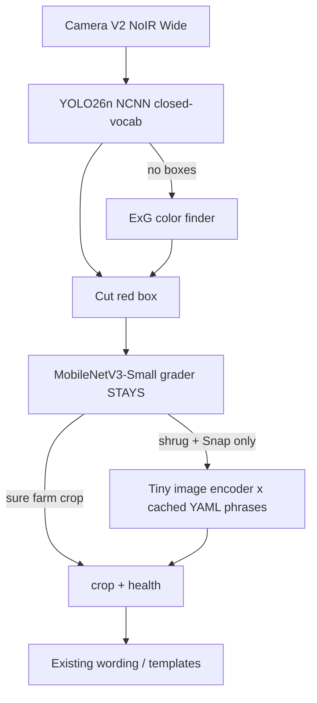

# Pi 4B: YOLO plant boxes + CLIP-style dictionary

**Project:** Plant Health Scanner (PC MVP now, Raspberry Pi 4B 8 GB later)  
**Date:** 2026-08-17  
**Hardware:** Raspberry Pi 4 Model B 8 GB, Camera V2 NoIR Wide. Broadcom BCM2711, quad Cortex-A72 @ 1.8 GHz, VideoCore VI. No NPU. Vulkan 1.0 is on the spec sheet; it is not a useful DNN GPU for this stack.  
**Status:** research only — no code in this slice

Everyday version: the PC uses a celebrity box-drawer (YOLO-World), a pop-quiz inspector (MobileNet), and a library (CLIP). The Pi is a four-core bicycle. The celebrity and the library do not fit on the bicycle. Distill means: the chef stays in the kitchen; the apprentice rides the bike.

---

## Short answer

**Do not copy the PC live path onto the Pi.** `yolov8s-worldv2.pt` and CLIP ViT-B/32 via `transformers` are too heavy, and YOLO-World v2 has **no official NCNN or TFLite/LiteRT export**.

**Do this instead:**

1. **Boxes:** closed-vocab nano detector (`YOLOv8n` / `YOLO11n` / **`YOLO26n`**) exported to **NCNN**. Classes `{plant, leaf}` to match today’s World prompts. Keep ExG as the free fallback. Distill World by **pseudo-labels on the PC**, not Ultralytics `distill_model` (that API is same-family only).
2. **Grader:** keep `models/best.pt` (MobileNetV3-Small). Export INT8 LiteRT later. Do not replace it.
3. **Dictionary:** keep `data/plant_dictionary.yaml`. Do **not** load CLIP ViT-B/32 on the Pi. Recache phrase vectors on the PC. On the Pi, either skip extra PH names on v1, or run a **tiny image encoder** whose vectors still match that cache.

**Live on Pi 4 is Snap-speed, not 30 FPS.** Official YOLOv8n NCNN on Pi 4 @ 640 is **~415 ms/frame**. Our PC already uses World at `imgsz=320`; a nano at 320 is the realistic Live boxer.

---

## What we have today (must keep by name)

| Role | Asset | Job | Everyday version |
| --- | --- | --- | --- |
| Box finder (PC) | Ultralytics YOLO-World v2 `models/yolov8s-worldv2.pt` (AGPL-3.0), classes `plant` / `leaf`, `imgsz=320` | Red squares | Celebrity with a scriptwriter (CLIP text) |
| Fallback boxes | Green ExG color finder in `src/detect.py` | Boxes when World fails | “Anything greener than dirt” |
| Grader | MobileNetV3-Small `models/best.pt` (~3.7 MB) | 6 crop heads (palay, eggplant, lettuce, tomato, sili, other) + 4 health + in-list gate | Pop-quiz inspector. **Stays.** |
| Dictionary | OpenAI CLIP ViT-B/32 via `transformers` + `data/plant_dictionary.yaml` + `models/dictionary_clip.pt` | Extra PH names when CNN is unsure | Librarian. The **card catalog** is tiny; the **eyes** are huge. |
| PC live path | YOLO boxes → CNN → CLIP | Too heavy to copy | Three brains sharing one hallway |

`dictionary_clip.pt` is already a **text-only** cache (phrase vectors + YAML fingerprint). Inference still loads the full CLIP **image** tower in `_image_z()`. YAML can survive without shipping CLIP if the Pi image encoder lives in the **same vector space** as that cache.

---

## Recommended Pi architecture

Sequential. One vision job at a time. Four Cortex-A72 cores cannot run World, MobileNet, and CLIP in parallel without fistfighting.



| When | What is loaded | What is idle |
| --- | --- | --- |
| Live boxes | Nano NCNN only | CNN and dictionary |
| After a box (Live) | CNN grader | Nano can idle; **no CLIP** |
| Snap, CNN unsure | Tiny dictionary image encoder + `dictionary_clip.pt` (or recached bank) | Nano idle |
| Never at once | World + CLIP ViT-B/32 + CNN + nano | — |

INT8: LiteRT full-integer for the **grader** (Google’s documented 3x+ CPU speedup path). NCNN **FP16** first for nano (`quantize=16` in Ultralytics NCNN export). NCNN INT8 is a Tencent-tooling extra, not the Ultralytics Raspberry Pi default.

---

## 1. Can YOLO-World v2 (`yolov8s-worldv2`) run on Pi 4?

**Technically yes as PyTorch/ONNX CPU. Practically no for Live. Official NCNN/TFLite: no.**

YOLO-World is YOLOv8 plus a CLIP text encoder plus RepVL-PAN. You type “plant”; it matches boxes to that phrase. The paper’s **prompt-then-detect** trick can bake the phrases into conv weights and **drop the text encoder** at deploy time. Even then the visual net is **YOLOv8-S class**, not nano.

| Fact | Number | Source |
| --- | --- | --- |
| YOLO-World-S params | **13M** re-parameterized / **77M** with text encoder | [YOLO-World paper Table 2](https://arxiv.org/html/2401.17270v3) |
| YOLO-World-S speed (paper) | **74.1 FPS** reparam / **19.9 FPS** with text encoder, **NVIDIA V100**, not Pi | Same table |
| YOLOv8s (closed) on **Pi 4** NCNN @640 | **1042 ms/im**, 42.7 MB | [Ultralytics Pi guide, 2024 commit](https://github.com/ultralytics/ultralytics/blob/6f4a9cf557db8147e582589b766de56f1ae08bf4/docs/en/guides/raspberry-pi.md) |
| YOLOv8s on Pi 4 PyTorch @640 | **2589 ms/im** | Same |
| YOLOv8s on Pi 4 ONNX @640 | **1436 ms/im** | Same |
| Ultralytics World v2 export | **torchscript, onnx, openvino, engine, coreml only** — not NCNN, not TFLite/LiteRT | [YOLO-World docs](https://docs.ultralytics.com/models/yolo-world/), [exporter warning](https://github.com/ultralytics/ultralytics/blob/main/ultralytics/engine/exporter.py), [issue #15967](https://github.com/ultralytics/ultralytics/issues/15967) |
| Upstream World deploy | ONNX checked; **TFLite unchecked** | [AILab-CVC/YOLO-World deploy.md](https://github.com/AILab-CVC/YOLO-World/blob/master/docs/deploy.md) |

**Latency if we tried anyway (not measured on this board):** World-S ≈ YOLOv8s. Official Pi 4 YOLOv8s NCNN is already **~1.0 s @640**. Our PC uses `imgsz=320` (~4× less pixels). That might land in the **~0.3–0.8 s** band **if** a supported runtime worked — still a Live stutter, still no NCNN, still AGPL, still a Small net next to a nano.

**RAM:** 8 GB is enough to *load* World. The kill is **CPU time**, Python/PyTorch overhead, and the missing NCNN path. Do not ship `yolov8s-worldv2.pt` to the Pi.

---

## 2. Realistic Pi-4 substitute for boxes

Compare four options. Goal: red squares around plants, then the **existing** MobileNet names the crop.

| Option | What it is | Pi 4 latency (known) | RAM / disk | Open-vocab? | Fit for this project |
| --- | --- | --- | --- | --- | --- |
| **A. YOLO26n NCNN** | Current Ultralytics nano, 2.4M params, 5.4B FLOPs, NMS-free default | **No official Pi 4 table.** Pi **5** NCNN @640: **67 ms**. Pi 4 is A72 1.8 GHz vs A76 2.4 GHz; expect **several× slower** than Pi 5 | 9.4 MB NCNN on Pi 5 table | No. Train `{plant, leaf}` or crop names | **Best default** if AGPL is OK |
| **B. YOLO11n NCNN** | 2.6M params, 6.5B FLOPs | No official Pi 4 table. Pi 5 ONNX: YOLO11n 128 ms vs YOLO26n 128 ms in one table; YOLO26n is the one Ultralytics now benches on Pi | Similar nano | No | Fine. Slightly older family |
| **C. YOLOv8n NCNN** | 3.2M params, 8.7B FLOPs | **Official Pi 4 @640: 415 ms** (NCNN), 560 ms ONNX, 950 ms TFLite, 1068 ms PyTorch | 12.2 MB NCNN | No | **Best-documented Pi 4 number.** Same family as World if we later distill v8→v8 |
| **D. ExG color finder** | `2G − R − B`, already in `find_plants_exg` | Milliseconds, CPU only | ~0 | No | **Keep as fallback.** Fails on brown palay, fruit, mixed light, NoIR without IR |
| **E. Distill World → nano** | Teacher World on PC; student nano on Pi | Student = A/B/C speed | Student size | No at runtime | **How we get plant/leaf boxes without shipping World** |

Community (not Ultralytics): YOLOv8n NCNN on Pi 4B ~400–600 ms @640 ([issue #12996](https://github.com/ultralytics/ultralytics/issues/12996)); 434 / 210 / 139 ms at 640 / 480 / 320 ([Star7 benchmark README](https://github.com/Star7-Github/yolov8n-rpi4b-benchmark)).

**Class list for the student:**

| Classes | Pros | Cons |
| --- | --- | --- |
| `{plant, leaf}` | Matches today’s World prompts. Naming stays on MobileNet + dictionary. Less labeling. | Box is still anonymous until CNN |
| `{palay, eggplant, lettuce, tomato, sili, plant}` | Box *is* a farm name | Duplicates the grader. Needs real boxes per crop. “plant” dump class for everything else |

**Recommendation:** `{plant, leaf}` for Pi v1. Do not put five crop names on the detector until we have labeled boxes and a reason to bypass MobileNet.

**imgsz:** keep **320** (current PC World) or 416. 640 is the official bench; it is slower than we need for Live.

YOLOE-26n-seg exists (open-vocab, 4.8M params) and still AGPL. It is a later experiment, not the first Pi boxer. [YOLOE docs](https://docs.ultralytics.com/models/yoloe).

---

## 3. How detection distillation actually works

Two different recipes. Do not mix them up.

### 3a. Classic idea (papers)

A big **teacher** is frozen. A small **student** copies it. After training, only the student ships.

| Paper | What gets copied | Detect-specific? |
| --- | --- | --- |
| Hinton, Vinyals, Dean 2015. *Distilling the Knowledge in a Neural Network.* [arXiv:1503.02531](https://arxiv.org/abs/1503.02531) | Soft class scores (temperature softmax) | Classification |
| Romero et al. 2015. *FitNets.* [arXiv:1412.6550](https://arxiv.org/abs/1412.6550) | Mid-network “hints” (features) | Classification |
| Chen et al. 2017. *Learning Efficient Object Detection Models with Knowledge Distillation.* [NeurIPS 2017](https://proceedings.neurips.cc/paper/2017/hash/e1e32e235eee1f970470a3a6658dfdd5-Abstract.html) | Weighted class loss + **teacher-bounded box regression** + hint adapters | **Yes.** Detection has boxes, many empty anchors, class imbalance |

Everyday version: the teacher does not hand over the textbook. It hands over **graded exams** (soft scores) and **scribbles in the margin** (features / boxes). The student learns the vibe, not just the one-hot answer.

### 3b. Ultralytics `distill_model` (official, 2026)

Docs: [Knowledge Distillation](https://docs.ultralytics.com/guides/knowledge-distillation/). Code: `ultralytics/nn/distill_model.py`.

How it works (from the docs, not folklore):

1. Teacher frozen, `eval`, runs every batch.
2. Student trains with normal `box_loss + cls_loss + dfl_loss`.
3. Features taken from the **three neck layers** that feed the Detect head.
4. A 1×1 conv projector lines student channels up to teacher channels.
5. **Score-weighted L2** on those features (`dis` weight, default 6.0).
6. Saved weights = **student only**. Same size and speed as a normal nano.

**Hard rules:**

- Teacher and student must be the **same YOLO family** (v8↔v8, 11↔11, 26↔26). **Cross-family is not supported.**
- YOLO-World is a **World/RepVL head**, not a plain Detect nano. Official `distill_model` **will not** turn `yolov8s-worldv2` into `yolov8n` or `yolo26n`.
- Classify / CLIP-style tasks are not this API.

Recommended pairs in the docs: `yolo26n` ← `yolo26s`, `yolo26s` ← `yolo26m`, etc.

### 3c. Recipe for THIS project (World teacher → nano student)

This is **pseudo-label distillation**, the path that actually matches an open-vocab teacher to a closed-vocab nano.

**Labeled data we need:**

| Item | Why |
| --- | --- |
| Unlabeled / weakly labeled farm + NoIR stills | Teacher can box them |
| Human review of a sample | World will box pots, weeds, green shirts, plastic |
| YOLO detect YAML: images + `{plant, leaf}` boxes | Student training format |
| Optional: extra `{plant, leaf}` from public sets | Bootstrap if robot photos are thin |
| **Not required:** CLIP phrases, CNN labels, health grades | Different heads |

How many images? No official number for this crop set. Fine-tuning a nano typically wants **hundreds+ of images per class** after review, more if the camera is NoIR Wide (plants look small). Pseudo-labels let us scale unlabeled stills; humans still have to throw out junk.

**Numbered steps (boxes):**

1. On the **PC**, keep `yolov8s-worldv2.pt` with `set_classes(["plant", "leaf"])`.
2. Run it on a pile of Camera V2 NoIR / field stills at `imgsz=320` (same as live). Save boxes + class ids.
3. Spot-check. Delete boxes on soil, buckets, people.
4. Write a YOLO detect dataset (`images/` + `labels/` + `data.yaml`) with names `plant`, `leaf`.
5. Train a **closed** student: `yolov8n.pt` (same family as World) **or** `yolo26n.pt` (better Pi story, no World-family KD).
6. Optional same-family KD: if student is YOLO26n, first train YOLO26s on the **same** boxes, then `distill_model=yolo26s.pt`. Do **not** pass World as `distill_model`.
7. Export `format=ncnn`, `imgsz=320` (or 416). Copy the `*_ncnn_model/` folder to the Pi. Export NCNN on x86 if Pi export hits illegal-instruction PyTorch issues ([ultralytics#19091](https://github.com/ultralytics/ultralytics/issues/19091)).
8. Pi Live: nano boxes → existing MobileNet. ExG if nano returns nothing.

The chef never rides the robot.

---

## 4. Can CLIP ViT-B/32 run on Pi 4?

**It will load. It will not Live. Do not ship it.**

| Piece | Size | Source |
| --- | --- | --- |
| OpenAI CLIP ViT-B/32 total | **151.28M** params (image **87.85M** + text **63.43M**), embed 512 | [OpenCLIP `model_profile.csv`](https://github.com/mlfoundations/open_clip/blob/main/docs/model_profile.csv) |
| Image FLOPs | **8.82 GFLOPs** @224 | Same |
| Hugging Face `openai/clip-vit-base-patch32` | **`pytorch_model.bin` 605 MB** | [HF file page](https://huggingface.co/openai/clip-vit-base-patch32/blob/main/pytorch_model.bin) |
| Our text cache | `models/dictionary_clip.pt` — phrase matrix only | `src/dictionary.py` |
| Official Pi 4 CLIP latency | **None published** by OpenAI / Ultralytics | — |

Our own PC study already treated CLIP as **~0.4–2+ s on CPU** per crop ([faster-crop-name.md](faster-crop-name.md)). Pi 4 A72 is slower than a desktop CPU. Expect **seconds per box**, plus a multi-second first load of `transformers` + 605 MB weights. RAM: 8 GB can hold it; Live cannot wait for it.

**Can we keep the YAML without loading full CLIP?** **Yes.** That is the whole point of `dictionary_clip.pt`. Runtime only needs:

```text
image_vector  ·  cached_phrase_vectors  →  extra PH name
```

The YAML is the phrase list. The cache is the math. The Pi never needs the CLIP **text** tower if we recache on the PC. It only needs **some** image encoder in that same space.

### Dictionary alternatives

| Option | Image / text params | Official latency | YAML + cache? | License | Pi 4 honesty |
| --- | --- | --- | --- | --- | --- |
| CLIP ViT-B/32 (status quo) | 87.85M + 63.43M | None on Pi | Yes, current cache | **MIT** ([openai/CLIP LICENSE](https://github.com/openai/CLIP/blob/main/LICENSE)) | **No** for Live. Snap would freeze |
| **MobileCLIP-S0** | **11.4M + 42.4M**; IN-1k 67.8% | **1.5 + 1.6 ms on iPhone 12 Pro Max** (ANE, not Pi) | Yes after **recache** (different space) | Code MIT; **weights = Apple research / non-commercial** ([LICENSE_MODELS](https://github.com/apple/ml-mobileclip/blob/main/LICENSE_MODELS)) | Smallest real CLIP-like. Expect **hundreds of ms–~1 s** on Pi CPU. Snap only. Check license before product |
| MobileCLIP-S1 / S2 | 21.5+63.4 / 35.7+63.4 | 2.5+3.3 / 3.6+3.3 ms iPhone | Recache | Same Apple TOU | Heavier than S0 |
| MobileCLIP2-S0 | 11.4 + 63.4 | 1.5 + 3.3 ms iPhone; IN-1k **71.5%** | Recache | Same family of Apple model TOU | Better accuracy, bigger text tower — **drop text tower on Pi** |
| TinyCLIP ViT-8M/16 + Text-3M | ~8M + 3M | Throughput on **V100**, not Pi; IN-1k **41.1%** | Recache | [microsoft/Cream TinyCLIP](https://github.com/microsoft/Cream/tree/main/TinyCLIP) (ICCV 2023) | Smallest CLIP distill. Weaker names. Still a dual encoder |
| TinyCLIP ViT-22M/32 | ~22M + 10M; IN-1k 53.7% | V100 | Recache | Same | Still fatter than we want next to nano+CNN |
| SigLIP-base-patch16-224 | **~0.2B / 203M** (OpenCLIP ViT-B-16-SigLIP **203.16M**) | None on Pi | Recache | Google / HF | **Heavier than CLIP B/32.** There is **no official “SigLIP-tiny.”** Do not ship |
| SigLIP So400m | ~877M class | None on Pi | — | Google | Absurd on Pi 4 |
| **Distill CLIP image → tiny CNN** | Student can be MobileNet-class | Student speed | **Yes — keep current `dictionary_clip.pt` if student outputs 512-d CLIP space** | Teacher MIT | **Best long-term** if we want YAML without Apple TOU |

Apple MobileCLIP latency is **iPhone Neural Engine**, not Cortex-A72. Quote it only as “this model is built for phones”; do not expect 1.5 ms on the Pi.

OpenCLIP is the training library for many of these ([mlfoundations/open_clip](https://github.com/mlfoundations/open_clip)). It does not make ViT-B/32 small.

### Recipe for dictionary distillation (keep YAML)

Goal: Pi never loads CLIP. YAML still means “add a plant, recache on PC, copy a small file.”

1. Keep encoding `data/plant_dictionary.yaml` on the **PC** with current CLIP ViT-B/32. Keep `models/dictionary_clip.pt` (512-d, L2-normalized).
2. Collect crop photos (CNN shrug cases + whole plants). No extra class labels required.
3. Teacher: CLIP `get_image_features` → 512-d vector.
4. Student: small CNN (new trunk; **do not replace** `best.pt` heads) that outputs 512-d. Loss: cosine / MSE to the teacher vector (FitNets-style hint in CLIP space; TinyCLIP’s affinity mimicking is the CLIP-native cousin).
5. Validate: student·cached_phrases vs CLIP·cached_phrases on a held-out set of PH names.
6. Export student INT8 LiteRT or NCNN. Pi: `student(image) · text_z`. Add a plant = edit YAML, run `training/cache_dictionary.py` on PC, copy the cache.

If we switch to MobileCLIP-S0 instead of a custom CNN: recache phrases with **S0’s** text encoder on the PC; Pi runs **S0 image encoder only**. Do not mix CLIP cache with MobileCLIP vectors.

**Do not** run the dictionary on Live. Farm names stay on MobileNet. Extra PH names wait for **Snap** when the CNN says `other` / unsure. Same diet as [faster-crop-name.md](faster-crop-name.md).

---

## 5. RAM / latency budget (Pi 4B 8 GB)

8 GB is the whole house: OS, camera, Python, models. VideoCore VI does **not** take the DNN homework (spec: OpenGL ES 3.1 + Vulkan 1.0 for display/video, [Pi 4 specs](https://www.raspberrypi.com/products/raspberry-pi-4-model-b/specifications/)).

| Slice | Disk | Runtime (order of magnitude) | Latency target |
| --- | --- | --- | --- |
| Raspberry Pi OS Lite | — | ~0.3–0.6 GB idle | — |
| Desktop GUI | — | extra 0.3–0.5 GB | Avoid on the robot |
| YOLO26n / YOLOv8n NCNN @320 | ~9–12 MB | low hundreds of MB with Python wrapper; much less in raw NCNN C++ | **~0.15–0.5 s** Live box (YOLOv8n @640 official **415 ms**; 320 is faster) |
| MobileNetV3-Small `best.pt` | ~3.7 MB | tens of MB | tens–low hundreds of ms INT8 |
| YAML + `dictionary_clip.pt` | hundreds of KB | tiny | matrix multiply, negligible |
| Tiny dict image encoder (goal) | few–15 MB | tens of MB | Snap only, **&lt; 1 s** |
| CLIP ViT-B/32 + transformers | **605 MB** | **~1–2+ GB** with PyTorch | **seconds** — do not ship |
| YOLO-World v2 PyTorch | tens of MB weights | hundreds of MB–1 GB | **~1 s+ @640 S-class** — do not ship |

**Budget rule:** Live = nano + (CNN after box). Snap = CNN, then dictionary if shrug. Never World. Never ViT-B/32.

NoIR Wide: plants occupy fewer pixels. Prefer `imgsz=320`. IR illuminator at night or ExG falls over.

---

## 6. What NOT to ship on the Pi

- `models/yolov8s-worldv2.pt` and Ultralytics World at runtime
- `transformers` CLIP ViT-B/32 / OpenCLIP ViT-B/32
- SigLIP-base or So400m
- PyTorch YOLO as the Live path (official Pi 4 YOLOv8n PyTorch **1068 ms**)
- Parallel World + CNN + CLIP
- Ultralytics `distill_model=yolov8s-worldv2.pt` into YOLO26n (illegal pairing)
- Replacing `models/best.pt`
- Apple MobileCLIP **weights** in a commercial product without reading [LICENSE_MODELS](https://github.com/apple/ml-mobileclip/blob/main/LICENSE_MODELS)
- LiteRT **export on the Pi** (`litert-converter` has no aarch64 wheel; export on x86/mac, copy `.tflite`) — [Pi guide](https://docs.ultralytics.com/guides/raspberry-pi/)

---

## 7. License

| Piece | License | Product meaning |
| --- | --- | --- |
| Ultralytics YOLOv8 / YOLO11 / YOLO26 / YOLO-World / YOLOE | **AGPL-3.0** or paid Enterprise | Fine-tuned weights inherit AGPL. Closed-source / embedded product without publishing the **whole app** needs [Enterprise](https://www.ultralytics.com/license) |
| Our MobileNet grader | whatever we trained it under (not Ultralytics detect) | Keep |
| OpenAI CLIP code + weights | **MIT** | OK as PC teacher and for the cache |
| Hugging Face `transformers` | Apache-2.0 | Runtime we do not want on Pi anyway |
| Apple MobileCLIP **code** | MIT | OK |
| Apple MobileCLIP **models** | Apple ML Research Model TOU — **research, non-commercial** | Do not drop S0 weights into a sold farm gadget without legal review |
| TinyCLIP (Microsoft Cream) | see repo LICENSE | Distilled CLIP family |
| YOLOX | **Apache-2.0** ([Megvii YOLOX](https://github.com/Megvii-BaseDetection/YOLOX)) | Permissive nano-class detector if AGPL is a blocker |
| RTMDet | MIT (OpenMMLab) | Permissive alternative |
| NCNN | Tencent; permissive (BSD-style on GitHub) | Runtime, not the detector IP |
| LiteRT / TFLite | Google Apache-2.0 stack | Runtime |
| ExG | Color index from Woebbecke et al. 1995; our code | No AGPL |

If this repo stays public AGPL-friendly: **YOLO26n NCNN is the boxer.** If we later sell a closed box: plan YOLOX/RTMDet **or** Ultralytics Enterprise **before** we pour weeks into YOLO26 labels.

---

## Recommendation for THIS project

**Pi v1 (ship):**

1. Keep MobileNetV3-Small as the only namer/grader.
2. Replace World with **YOLO26n NCNN** (or YOLOv8n if we want the official Pi 4 415 ms number and same-family KD), classes `{plant, leaf}`, `imgsz=320`, trained from World pseudo-labels + review.
3. Keep ExG fallback.
4. **Do not** put CLIP ViT-B/32 on the Pi. Extra PH names: skip on Live; optional Snap later.

**Pi v1.1 (dictionary):**

5. Distill CLIP **image** space into a tiny CNN; keep YAML + `dictionary_clip.pt`. Snap-only. Avoid MobileCLIP weights unless the product is clearly research-only.

**Never:** World NCNN fantasy, SigLIP, Live CLIP, replacing `best.pt`.

Build order: grader INT8 → World auto-box dataset → nano NCNN on Pi Snap → ExG fallback → dictionary student last.

---

## Distillation recipes (checklist)

### Boxes (World → nano)

1. PC: World v2, classes `plant` / `leaf`, `imgsz=320`.
2. Auto-box NoIR / field stills.
3. Human-delete junk boxes.
4. YOLO detect dataset YAML.
5. Train `yolo26n` (or `yolov8n`) on those boxes.
6. Optional: same-family `distill_model` from nano’s bigger sibling trained on the **same** set.
7. `export(format="ncnn")` on a PC; copy to Pi.
8. Pi: nano → MobileNet. ExG if empty.

### Dictionary (CLIP → tiny encoder, YAML stays)

1. PC: cache YAML with CLIP ViT-B/32 → `dictionary_clip.pt`.
2. Teacher image vectors on crop photos.
3. Train tiny CNN to match 512-d CLIP image space.
4. Check ranking vs YAML phrases vs teacher.
5. Export tiny encoder INT8.
6. Pi Snap: encoder · cache. Never load CLIP.

---

## Sources (primary)

**Hardware**

- [Raspberry Pi 4 Model B specifications](https://www.raspberrypi.com/products/raspberry-pi-4-model-b/specifications/)

**Ultralytics / YOLO**

- [Raspberry Pi guide (current, YOLO26, Pi 5 NCNN 67 ms)](https://docs.ultralytics.com/guides/raspberry-pi/)
- [Raspberry Pi guide 2024 commit (YOLOv8n Pi 4 NCNN 414.73 ms)](https://github.com/ultralytics/ultralytics/blob/6f4a9cf557db8147e582589b766de56f1ae08bf4/docs/en/guides/raspberry-pi.md)
- [NCNN export](https://docs.ultralytics.com/integrations/ncnn)
- [Export modes (NCNN, LiteRT)](https://docs.ultralytics.com/modes/export)
- [YOLO-World](https://docs.ultralytics.com/models/yolo-world)
- [YOLOv8](https://docs.ultralytics.com/models/yolov8) · [YOLO11](https://docs.ultralytics.com/models/yolo11) · [YOLO26](https://docs.ultralytics.com/models/yolo26)
- [Knowledge distillation](https://docs.ultralytics.com/guides/knowledge-distillation/)
- [YOLOE](https://docs.ultralytics.com/models/yoloe)
- [Ultralytics license](https://www.ultralytics.com/license)
- [World TFLite export not supported, #15967](https://github.com/ultralytics/ultralytics/issues/15967)
- [YOLOv8n Pi 4B NCNN user times, #12996](https://github.com/ultralytics/ultralytics/issues/12996)
- [NCNN export / ARM torch, #19091](https://github.com/ultralytics/ultralytics/issues/19091)

**YOLO-World paper / upstream**

- Cheng et al. 2024. *YOLO-World: Real-Time Open-Vocabulary Object Detection.* [arXiv:2401.17270](https://arxiv.org/abs/2401.17270) · [HTML](https://arxiv.org/html/2401.17270v3)
- [AILab-CVC/YOLO-World deploy.md](https://github.com/AILab-CVC/YOLO-World/blob/master/docs/deploy.md) · [reparameterize.md](https://github.com/AILab-CVC/YOLO-World/blob/master/docs/reparameterize.md)

**CLIP / MobileCLIP / TinyCLIP / SigLIP / OpenCLIP**

- Radford et al. 2021. *Learning Transferable Visual Models From Natural Language Supervision.* [arXiv:2103.00020](https://arxiv.org/abs/2103.00020) · [openai/CLIP](https://github.com/openai/CLIP) · [MIT LICENSE](https://github.com/openai/CLIP/blob/main/LICENSE)
- [HF openai/clip-vit-base-patch32 (605 MB)](https://huggingface.co/openai/clip-vit-base-patch32/blob/main/pytorch_model.bin)
- [OpenCLIP model_profile.csv](https://github.com/mlfoundations/open_clip/blob/main/docs/model_profile.csv)
- Vasu et al. *MobileCLIP.* [arXiv:2311.17049](https://arxiv.org/abs/2311.17049) · [apple/ml-mobileclip](https://github.com/apple/ml-mobileclip) · [LICENSE_MODELS](https://github.com/apple/ml-mobileclip/blob/main/LICENSE_MODELS)
- Wu et al. 2023. *TinyCLIP.* ICCV. [CVF PDF](https://openaccess.thecvf.com/content/ICCV2023/papers/Wu_TinyCLIP_CLIP_Distillation_via_Affinity_Mimicking_and_Weight_Inheritance_ICCV_2023_paper.pdf) · [microsoft/Cream TinyCLIP](https://github.com/microsoft/Cream/tree/main/TinyCLIP)
- Zhai et al. *SigLIP.* [arXiv:2303.15343](https://arxiv.org/abs/2303.15343) · [google/siglip-base-patch16-224](https://huggingface.co/google/siglip-base-patch16-224)

**Distillation papers**

- Hinton et al. 2015. [arXiv:1503.02531](https://arxiv.org/abs/1503.02531)
- Romero et al. 2015. FitNets. [arXiv:1412.6550](https://arxiv.org/abs/1412.6550)
- Chen et al. 2017. [NeurIPS PDF](https://proceedings.neurips.cc/paper_files/paper/2017/file/e1e32e235eee1f970470a3a6658dfdd5-Paper.pdf)

**Runtimes**

- [Tencent ncnn](https://github.com/Tencent/ncnn)
- [LiteRT](https://ai.google.dev/edge/litert) · [Post-training quantization](https://ai.google.dev/edge/litert/models/post_training_quantization)

**ExG**

- Woebbecke et al. 1995. Color indices for weed identification. *Trans. ASAE* 38(1):259–269. `2g−r−b`. Used in-field on Pi-class hardware in [OpenWeedLocator, Sci Rep 2022](https://doi.org/10.1038/s41598-021-03858-9)

**Permissive detectors**

- [YOLOX Apache-2.0](https://github.com/Megvii-BaseDetection/YOLOX)

**Community Pi 4 (labeled as such)**

- [Star7 yolov8n-rpi4b-benchmark](https://github.com/Star7-Github/yolov8n-rpi4b-benchmark)

**This repo**

- [faster-crop-name.md](faster-crop-name.md) · [v0-implementation.md](../v0-implementation.md) · `src/detect.py` · `src/dictionary.py`
