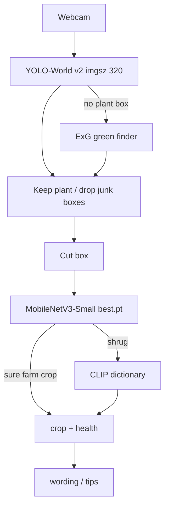
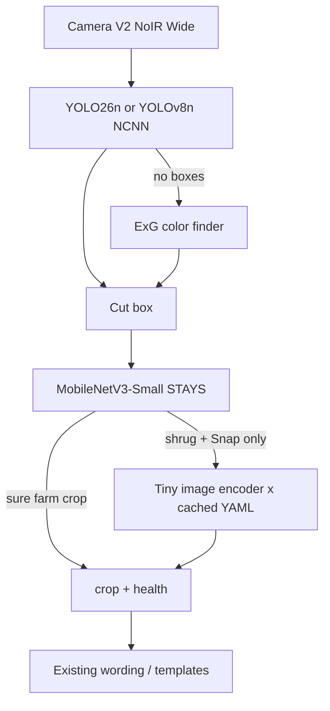

# Plant Health Scanner — spec

**Status:** `src/kiosk.py` is the product. Raspberry Pi 4B **lite** install is in `deploy/install-pi.sh`. Nano/LiteRT export is still later.  
**This file is the living spec.** Run/install: [install.md](install.md). Older story: `docs/initial-plan/`. Model-choice writeups: `docs/research/`.

Everyday version: a 7 inch kiosk that points a camera at a plant, draws a box, names the farm crop, grades how bad it looks, and says one short tip. The PC window is the same size as the real LCD. The Pi is a slower bicycle — we do not copy the PC’s celebrity models onto it.

---

## 1. Product contract

The robot (today: a PC webcam) takes a **photo of a leaf or whole plant**. Vision returns **what crop it is** and **how healthy it looks**. A small writer turns that into **short English advice**. Photos stay on the machine.

| Field | Values |
| --- | --- |
| `crop` | `palay`, `sili`, `tomato`, `eggplant`, `lettuce`, or `unknown` |
| `health` | `healthy`, `mild`, `critical`, `dead`, or `unknown` |
| `view` | `leaf` (CNN close-up), `plant` (whole plant / fruit), `junk` (not a crop) |
| `named_plant` | Extra PH name when the CNN does not own the class (mais, kape, …) |
| `tip` | One or two sentences from facts only — the writer never sees pixels |

Health is a **severity gauge**, not a disease name (not “early blight”). Crop is **species-level**, not cultivar.

If the photo is unclear, the system says **try again** instead of guessing.

### 1.1 Farm crops (v1)

Palay (rice), sili (chili / pepper), tomato, eggplant (talong), lettuce (letsugas).

The CNN also has an `other` class: “not one of those five.” Extra Philippine plants live in the YAML dictionary, not in the CNN softmax.

### 1.2 Modes

| Mode | Now | Later |
| --- | --- | --- |
| Manual | Operator aims, Live names, shutter saves a PNG | Same UI on the 7 inch panel |
| Auto-pause | Not built | Other team: detect plant → pause motors → scan → resume |

### 1.3 Non-goals (v1)

- Motor / GPIO / serial robot link
- Night / IR grading pipeline (NoIR camera is for later field work)
- Cloud VLMs (GPT, Pl@ntNet API)
- 30 FPS Live on the Pi
- “Every plant in the Philippines” as an open-ended claim
- Shipping YOLO-World or CLIP ViT-B/32 on the Pi

---

## 2. Hardware

| Role | Spec |
| --- | --- |
| PC demo | Windows desktop, webcam, NVIDIA GPU for train (RTX 3050 Ti used) |
| Target compute | Raspberry Pi 4 Model B, **8 GB RAM**, 128 GB microSD |
| Target camera | Raspberry Pi Camera **V2 NoIR Wide** |
| Target display | Makerlab **7 inch HDMI LCD**, **1024 × 600**, IPS, USB capacitive touch |
| Lighting | Daytime outdoor; onboard visible LEDs as fill only |
| Pi GPU | VideoCore VI is for display, **not** a useful DNN accelerator |

Cables on the real Pi: HDMI = picture, USB = finger. This panel is driver-free on Raspberry Pi OS.

---

## 3. What we built — kiosk

**Entry:** `.\deploy\run-kiosk.ps1` on Windows, `bash deploy/run-kiosk.sh` on the Pi. Walkthrough: [install.md](install.md).  
**Window:** **1024 × 600**. Fullscreen on the 7 inch panel. Mouse click = finger tap.  
**Files:** `src/kiosk.py` (product), `src/pi_sim.py` (UI). Shared camera helpers: `src/camera.py`, `src/scan_drop.py`.

This is the kiosk the Pi runs. On a PC it is the same app, not a mock layout.

Pi default: **`--lite`** — ExG boxes + MobileNet. No YOLO-World, no CLIP. That is the machine that fits 8 GB RAM. PC default: World + CLIP unless you pass `--lite`.

### 3.1 Screen chrome (3 Tabs)

| Piece | Behavior |
| --- | --- |
| Title bar | “Plant Health” · **Scan** / **Gallery** / **Settings** · **Exit** |
| LIVE badge | Real-time camera status indicator |
| Stage | Viewfinder fills the panel under the title bar (1024×536) |
| Colored boxes | Multi-plant tracking. Primary focus box is solid `#aebf92`; others dashed `#c0b6a5` |
| Box Chips | "1" / "2" chips at top to select focus plant when multiple are framed |
| HUD cards | **Plant type** and **Plant health** (color-coded by grade) on top-left |
| Notes card | Glass card along the bottom displaying real-time actionable tip |
| Shutter | iPhone-style ring + disk. Tap captures full-res PNG with flash animation |
| GALLERY tab | Browse past scans, inspect health records & tips, delete scans |
| SETTINGS tab | Live color calibration (RGB, Saturation, Brightness, Contrast), Night/Morning profiles |

Empty camera: “No camera. Check the ribbon or plug in a USB webcam.”

### 3.2 Live vs capture

```text
LIVE  →  YOLO (or ExG) draws boxes every frame
      →  CNN names the biggest / tapped box (detail=False, assume_plant)
      →  if CNN shrugs, a second pass may use the dictionary (detail=True)
      →  HUD floats on the photo
      →  never writes a file until shutter

CAPTURE  →  flash + shutter punch
         →  write PNG of the viewfinder (boxes + plant type + health + notes)
         →  pulse GPIO 17 indicator LED (3 seconds)
         →  camera stays live
```

Live is the walk-the-row view. Capture is a photo of what you see, not a freeze. PNGs land on the microSD: `~/Pictures/plant-health` on the Pi (the 118 GB Linux partition), `data/scans/` on a PC.

### 3.3 Sister apps & Web Remote

| App | Job |
| --- | --- |
| `src/kiosk.py` | 7 inch kiosk & web server — **the product** |
| `src/pi_sim.py` | Same UI; `python src/pi_sim.py` still launches the kiosk |
| `src/server.py` | LAN Web Remote with 2-column symmetrical layout and full-res scan download |
| `src/camera.py` | Dual camera abstraction (Picamera2 dynamic AWB + Threaded USB V4L2 MJPG) |
| `src/scan_drop.py` | Larger PC webcam lab (Live / Snap / Browse) |
| `src/scan_cli.py` | Grade a file or folder, print JSON |

---

## 4. Runtime pipeline (as built on PC)

Everyday version: three people in a booth.

1. **Bouncer (YOLO)** draws a red square around anything that looks like a plant.
2. **Inspector (MobileNet)** takes the square and sits a multiple-choice test: which of our five crops, and how sick.
3. **Librarian (CLIP)** only speaks when the inspector shrugs — extra PH names, or “that’s a person / curtain.”
4. **Note-taker (wording)** writes the tip from JSON facts, never from the photo.



### 4.0 What we did to each model

| Piece | What we did |
| --- | --- |
| MobileNet `best.pt` | Loaded torchvision ImageNet weights (`MobileNet_V3_Small_Weights.DEFAULT`). Replaced the 1000-class head with crop / health / gate. Trained those heads, then the last 4 blocks, then the full backbone, on our labeled photos. Later runs continued the same file (`other` + gate, wild fruit/plants, indoor junk). |
| YOLO-World `yolov8s-worldv2.pt` | Downloaded Ultralytics weights. Prompt `{plant, leaf}` plus junk class names. Filter boxes in `src/detect.py`. Did not train or distill this file. |
| CLIP ViT-B/32 | Loaded OpenAI weights via `transformers`. Ran the text tower once on `plant_dictionary.yaml` → `dictionary_clip.pt`. Did not train CLIP. |
| ExG | Color formula `2G − R − B`. No weights. |
| Wording / Ollama | Templates in `src/tips.py`. Optional local LLM if installed. No vision training. |
| VGG19 | Researched only. Not in the product. Not used as a teacher for MobileNet. [research/vgg19-philippine-plant-recognition.md](research/vgg19-philippine-plant-recognition.md) |
| Pi nano boxer / tiny CLIP encoder | Not built. Plan in §6: pseudo-label World boxes on the PC, train a closed nano; later copy CLIP image vectors into a small encoder. |

### 4.1 Box finder — `src/detect.py`

| Asset | Job |
| --- | --- |
| `models/yolov8s-worldv2.pt` | Ultralytics YOLO-World v2. **AGPL-3.0.** PC only. |
| Classes kept | `plant`, `leaf` |
| Classes dropped | `person`, `human`, `curtain`, `drape`, `t-shirt`, `shirt`, `clothing`, `fabric`, `wall`, `furniture`, `window` |
| Predict | `imgsz=320`, `conf=0.22`, `max_det=20` |
| Overlap veto | A plant box that overlaps a junk box (≥ 0.35 IoU) is thrown out |
| Fabric / skin filter | Repeating folds, smooth dyed cloth, face-like skin → not a plant |
| ExG fallback | `2G − R − B` when YOLO is missing. **Not** used if YOLO already called the scene junk |
| Merge | Nearby boxes on the same canopy become one plant. Cap **5** |

The drop-class list is a prompt, not a custom-trained YOLO. We do **not** retrain YOLO-World. Training a boxer starts with the Pi nano in §6, from World pseudo-labels — not by updating this `.pt`.

### 4.2 Inspector — `src/infer.py` + `src/model.py`

**Weights:** `models/best.pt` (~3.7 MB) · **meta:** `models/meta.json`

```
ImageNet MobileNetV3-Small
  → GAP 576-d
  ├─ crop_head  → 6   palay, eggplant, lettuce, tomato, sili, other
  ├─ health_head → 4   healthy, mild, critical, dead
  └─ gate_head  → 1   sigmoid: in-list farm leaf?
```

Input: RGB **224×224**, ImageNet normalize.

Training (`src/model.py` + `training/finetune_other.py`):

1. Load ImageNet-pretrained MobileNetV3-Small. Drop the 1000-class head. Add crop, health, and gate heads.
2. Freeze the backbone. Train the heads.
3. Unfreeze the last 4 feature blocks. Train at a lower LR.
4. Unfreeze the full backbone. Train at a still lower LR.
5. Continue the same `best.pt`: expand 5 crops → 6 (`other` + gate), then wild fruit/whole-plant photos, then indoor junk.

`best.pt` stores weights only, not training images.

Code that matches infer is **`training/finetune_other.py`**. `training/train.py` is the old 5-crop starter (heads → last-4 only, no `other` / gate). Do not run it against the shipped 6-way checkpoint.

CNN unknown gates (`data/label_map.yaml`):

| Gate | Default | Meaning |
| --- | --- | --- |
| `crop_unknown_threshold` | 0.80 | Not confident enough |
| `crop_margin_threshold` | 0.18 | Top two crops too close |
| `other_threshold` | 0.35 | Looks like `other` |
| `in_list_threshold` | 0.40 | Gate says not a farm leaf |
| `health_unknown_threshold` | 0.45 | Health vote too weak |
| `dictionary_min_score` | 0.22 | CLIP phrase floor |

`plant_look` is a cheap color pass (leaf / fruit / skin). Fruit color can override a wrong CNN name (round red → tomato, skinny peppers → sili, purple → eggplant).

`looks_like_nonplant` (fabric periodicity, uniform dye, skin) can reject **even when** the boxer said `assume_plant=True`. That is how a curtain boxed as palay gets refused.

Crop-only photos (fruit / whole plant with no disease label) skip health loss at train time (`ignore_index=-1`). At infer, health may stay `unknown` on those views.

Latest `models/meta.json` val snapshot (junk-indoor finetune): crop ID **0.911**, OOD recall **0.895**, false-other **0.061**, health macro-F1 **0.832** (`dead` F1 is 0 — almost no dead labels in public sets).

### 4.3 Dictionary — `src/dictionary.py`

| Piece | Path |
| --- | --- |
| Phrase list | `data/plant_dictionary.yaml` |
| Text cache | `models/dictionary_clip.pt` |
| Recache | `python training/cache_dictionary.py` |
| Encoder | OpenAI CLIP ViT-B/32 via `transformers` (PC). Lazy-loaded. |

Entries are `kind: plant` or `kind: junk` (person, animal, object, curtain, clothing). Add a plant: edit YAML, recache. Do **not** fine-tune MobileNet unless that name should become a **graded farm crop**.

CLIP is the slow door. Live farm names should come from the CNN. Extra PH names wait for Snap / CNN shrug.

We did not train CLIP. `training/cache_dictionary.py` encodes YAML phrases with the frozen text tower and writes `dictionary_clip.pt`. At scan time the image tower encodes the crop and we pick the nearest phrase. Edit YAML, recache.

### 4.4 Wording — `src/wording.py` + `src/tips.py`

1. Ollama if up (`OLLAMA_HOST`, default `llama3.2:1b`)
2. Else Hugging Face generate if `LLM_MODEL` is set
3. Else templates in `src/tips.py`

The writer is shown only `{reject, reason, crop, health, view, dictionary_guesses}`. It must not invent a crop or a disease.

We did not train a language model on plant photos. Templates are in `src/tips.py`. Ollama / HF are optional local generate if already installed.

### 4.5 Color finder — ExG in `src/detect.py`

Formula `2G − R − B`. No weights, no training script. Used when YOLO returns no plant box. Disabled if YOLO already called the scene junk.

---

## 5. Training (what we actually ran)

Do **not** run `training/train.py` to update the shipped model. That script is the old **5-crop** path and will break infer. The live student is always **`training/finetune_other.py`** (6-way + health + gate weights already on disk).

### 5.1 What we trained vs what we only downloaded

Same facts as §4.0. Only `best.pt` was trained on our photos. YOLO and CLIP weights were not updated. Pi nano / tiny CLIP encoder are not built.

### 5.2 Data pipeline

| Step | Script | What it does |
| --- | --- | --- |
| 1 | `training/download.py` | PlantVillage, chili, eggplant, rice **leaf** close-ups |
| 2 | `training/download_wild.py` | PlantDoc, field veg, chili fruit, iNat whole plants, robot copies |
| 3 | `training/download_negatives.py` | Objects, other plants, indoor / people / clothes as `other` |
| 4 | `training/remap.py` | Folders → `crop` + `health` via `data/label_map.yaml` |
| 5 | `training/finetune_other.py` | Continue `best.pt`; skip health on unlabeled fruit rows |
| 6 | `training/finetune_gate.py` | Optional: hard-negative in-list gate |
| 7 | `training/cache_dictionary.py` | Rebuild CLIP phrase cache after YAML edits |

Wild one-shot: `python training/run_wild_train.py` (download → remap → finetune_other).

Grouped split by `group_id` so the same leaf does not leak into val.

Public sets name **diseases**. We map them to the four-level gauge using extension / IRRI typical outcomes in `data/label_map.yaml`. Sources: `data/SOURCES.md`. Crop-only rows (empty / `crop_only` health) skip health loss (`ignore_index=-1`).

### 5.3 Fine-tune phases (same recipe every time we touch `best.pt`)

Optimizer: AdamW. Mixed precision on CUDA. Batch auto-picked (192 on the RTX 3050 Ti). Windows `num_workers=2`.

| Phase | Backbone | LR | Epochs (`finetune_other.py`) |
| --- | --- | --- | --- |
| `heads` | Frozen | 1e-3 | 2 |
| `last4` | Last 4 blocks open | 2e-4 | 3 |
| `full` | All open | 5e-5 | 3 |

`training/train.py` (legacy) was heads 3 @ 1e-3 then last-4 5 @ 3e-4 — no `full` phase, no `other`, no gate.

If the checkpoint still has 5 crop names, `expand_checkpoint` copies the old crop-head rows and randomly inits the new `other` row. Gate head is new and trains from that run.

### 5.4 Runs that produced the shipped grader

Same `best.pt` chain. Each run backs up the previous file into `models/old models/`.

| Order | Job | Data added | Why |
| --- | --- | --- | --- |
| 1 | `training/train.py` | Lab leaf sets (PlantVillage-style) | First 5-crop + 4-health student from ImageNet. |
| 2 | `training/finetune_other.py` | Negatives: objects + other plants | Add `other` class + in-list gate so junk is not a farm name. |
| 3 | `training/run_wild_train.py` | PlantDoc, field veg, chili fruit, iNat whole plants | Fruit / whole-plant views (tomato in grass was reading as sili). Backup `best_before_wild_*`. |
| 4 | `training/finetune_other.py` again | Indoor Flickr-style rooms, clothes, people | Teach rooms/curtains as `other`. Backup `best_before_junk_*`. **This is the live file.** |
| — | `training/finetune_gate.py` | Optional hard-neg mine | Extra gate drill. Not required for the live checkpoint. |
| — | `training/cache_dictionary.py` | YAML phrases | Text cache only. After junk phrases were added, recache to 112 phrases. |

YOLO and CLIP weights were not updated. MobileNet was not initialized randomly. VGG19 was not used as a teacher.

---

## 6. Pi deployment plan

**Do not copy the PC Live path onto the Pi.** YOLO-World v2 has no official NCNN/TFLite export. CLIP ViT-B/32 is ~605 MB and seconds per box. Numbers and licenses: [research/pi-yolo-and-dictionary.md](research/pi-yolo-and-dictionary.md).

Everyday version: the chef (World + CLIP) stays in the PC kitchen. The apprentice (nano boxes + MobileNet) rides the bike.

§6 distillation (World boxes → nano; CLIP image → tiny encoder) is not built. MobileNet training is §4.2 / §5.

### 6.1 Target architecture on the Pi



| When | Loaded | Idle |
| --- | --- | --- |
| Live boxes | Nano NCNN only | CNN and dictionary |
| After a box (Live) | CNN grader | Nano can idle; **no CLIP** |
| Snap, CNN unsure | Tiny dictionary encoder + `dictionary_clip.pt` | Nano idle |
| Never at once | World + CLIP ViT-B/32 + CNN + nano | — |

Live on Pi 4 is **Snap-speed, not 30 FPS**. Official YOLOv8n NCNN on Pi 4 @640 is **~415 ms/frame**. Keep `imgsz=320` (same as PC World).

### 6.2 What stays / what is replaced

| Role | PC today | Pi v1 |
| --- | --- | --- |
| Boxes | YOLO-World v2 + junk word list + ExG | Closed-vocab **nano** `{plant, leaf}` NCNN + same ExG / fabric filters |
| Grader | `models/best.pt` PyTorch | **Same weights**, then INT8 LiteRT (export on x86, copy `.tflite`) |
| Dictionary | CLIP ViT-B/32 image tower | **Skip on Live.** Optional Snap: tiny encoder in CLIP space. YAML stays |
| UI | `src/kiosk.py` 1024×600 | Same app, **fullscreen** on the 7 inch panel |
| Wording | Templates; Ollama optional | Templates on device. Ollama only if we later prove RAM |

### 6.3 Build order

1. **Keep the kiosk.** `src/kiosk.py --fullscreen`. Do not redesign the UI.
2. **Export the grader.** MobileNet `best.pt` → INT8 LiteRT on a PC. Copy to the Pi. Prove crop + health on stills **without** World or CLIP.
3. **Pseudo-label boxes on the PC.** World at `imgsz=320` on NoIR / field stills. Human-delete curtains, shirts, pots. Write a YOLO detect set `{plant, leaf}`.
4. **Train a nano** (`yolo26n` preferred for the Pi story, or `yolov8n` for the official 415 ms number). Optional same-family KD from that nano’s bigger sibling on the **same** boxes. **Do not** pass World into Ultralytics `distill_model` (cross-family is illegal).
5. **Export nano NCNN on x86.** Copy `*_ncnn_model/` to the Pi. Live: nano → existing MobileNet. ExG if empty.
6. **Port the junk door.** Keep fabric / skin filters and the “if detector said junk, do not ExG” rule. Nano will not have World’s open-vocab drop classes unless we add a `not-plant` class to the detect set.
7. **Dictionary last.** Distill CLIP **image** vectors into a tiny CNN that outputs 512-d; keep YAML + recache on PC. Snap only. Do not load `transformers` CLIP on the Pi.
8. **Field fine-tune.** After the robot camera exists, finetune MobileNet again on **that** lighting and height. Same `finetune_other.py` path.

### 6.4 Install on the Pi

Step-by-step (cables, copy `best.pt`, scripts): **[install.md](install.md)**.

Short path: copy `dist/release/plant-health-kiosk-*.zip` to the Pi, unzip, then:

```text
cd ~/plant-health-kiosk
bash deploy/install-pi.sh
bash deploy/run-kiosk.sh
```

Details: **[install.md](install.md)**. Rebuild the zip on the PC with `python deploy/pack-pi.py`.

### 6.5 RAM / latency budget (Pi 4B 8 GB)

| Slice | Disk | Live? |
| --- | --- | --- |
| Nano NCNN @320 | ~9–12 MB | Yes, ~0.15–0.5 s/box |
| MobileNet `best.pt` / INT8 | ~3.7 MB | Yes, tens–low hundreds of ms |
| YAML + phrase cache | hundreds of KB | Snap matrix mul |
| Tiny dict encoder (goal) | few–15 MB | Snap only, &lt; 1 s |
| CLIP ViT-B/32 | 605 MB | **No** |
| YOLO-World PyTorch | tens of MB + heavy runtime | **No** |

Budget rule: **Live = nano + CNN after box. Snap = CNN, then dictionary if shrug.**

### 6.6 License (must decide before a sold box)

| Piece | License | Meaning |
| --- | --- | --- |
| Ultralytics YOLO / World | **AGPL-3.0** or paid Enterprise | Fine-tuned nano inherits AGPL unless Enterprise |
| Our MobileNet grader | Our training | Keep |
| OpenAI CLIP | MIT | PC teacher + cache OK |
| ExG | Color index; our code | No AGPL |
| Apple MobileCLIP **weights** | Research / non-commercial | Do not drop into a sold gadget without legal review |

If the repo stays public AGPL-friendly: YOLO26n NCNN is the boxer. If we sell a closed appliance: YOLOX / RTMDet **or** Ultralytics Enterprise **before** pouring weeks into YOLO26 labels.

---

## 7. Repo map

```text
docs/
  spec.md                 # this file — living product + Pi plan
  install.md              # PC run + Pi install
  initial-plan/           # original story, v0 writeup, 7 inch notes
  research/               # YOLO/CLIP/Pi numbers, VGG19, donor-brain
data/
  scans/                  # PC photos (PNG). Pi uses ~/Pictures/plant-health
  label_map.yaml          # folder → crop + health + thresholds
  plant_dictionary.yaml   # PH phrases + junk phrases
  SOURCES.md
src/
  kiosk.py                # product entry — fullscreen kiosk
  pi_sim.py               # kiosk UI
  camera.py               # Picamera2 CSI, else USB
  detect.py               # boxes (World on PC, ExG on Pi lite)
  infer.py                # Scanner
  model.py                # MobileNet two-head + gate
  dictionary.py wording.py tips.py
  scan_drop.py scan_cli.py
models/
  best.pt                 # live student — required on the Pi
  dictionary_clip.pt      # PC CLIP cache, not used in --lite
  yolov8s-worldv2.pt      # PC boxer only
  old models/             # backups
deploy/
  run-kiosk.ps1           # Windows: start the kiosk
  run-kiosk.bat           # Windows double-click
  setup-pc.ps1            # Windows: create .venv once
  pack-pi.py              # PC: build dist/release/plant-health-kiosk-*.zip
  run-kiosk.sh            # Pi: start fullscreen --lite
  install-pi.sh           # Pi: venv + autostart
  plant-health.desktop.in
  plant-health.service.in
training/
  finetune_other.py       # the train path that matches infer
  train.py                # legacy 5-crop — do not run on shipped weights
  run_wild_train.py download_wild.py download_negatives.py
  remap.py cache_dictionary.py finetune_gate.py
```

Run the kiosk:

```text
.\deploy\run-kiosk.ps1
```

Pi pack: `dist/release/plant-health-kiosk-*.zip` (unzip on the Pi, then `install-pi.sh`). Rebuild: `python deploy/pack-pi.py`.

Pi:

```text
bash deploy/install-pi.sh
bash deploy/run-kiosk.sh
```

Full walkthrough: [install.md](install.md).

---

## 8. Decision log

- Five farm crops + `other` + in-list gate. Junk is not a crop name.
- Four health levels. We do not output a pathogen name.
- Extra PH names live in YAML, not in the CNN.
- Whole-plant and fruit photos are first-class, not leaf-only.
- Boxes first, name second. Cap 5.
- YOLO-World is a PC bouncer with a junk word list. We do not retrain it. Pi gets a closed nano distilled from its boxes.
- MobileNet: ImageNet weights, then our crop/health/gate training on `best.pt`. VGG19 not used.
- CLIP: recache YAML text only. YOLO-World: download + prompts. Neither was trained by us.
- Capture writes a PNG of the live view (photo + boxes + HUD cards, no shutter) onto the microSD. Pi: `~/Pictures/plant-health`. PC: `data/scans/`. Live never writes. GALLERY browses those PNGs. No CSV export.
- LLM / templates see facts only.
- Cloud models are forbidden at scan time.
- `training/train.py` is legacy 5-crop. Shipped weights come from `finetune_other.py`.
